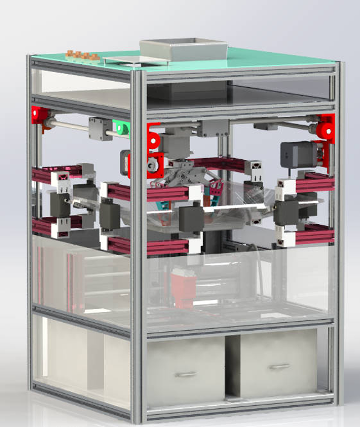
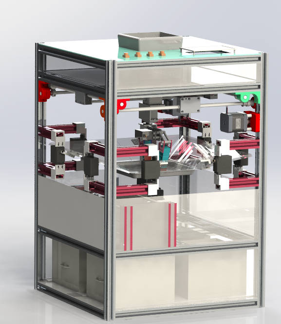
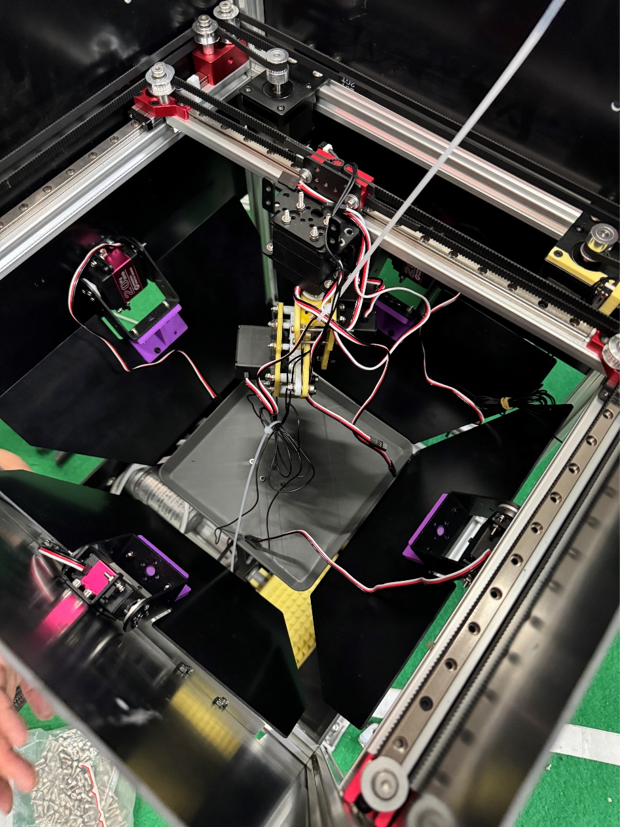
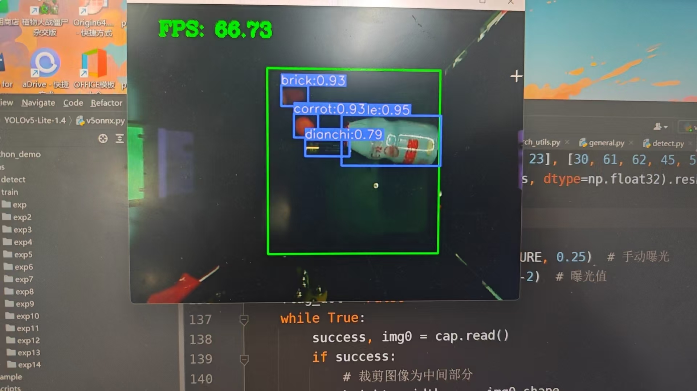
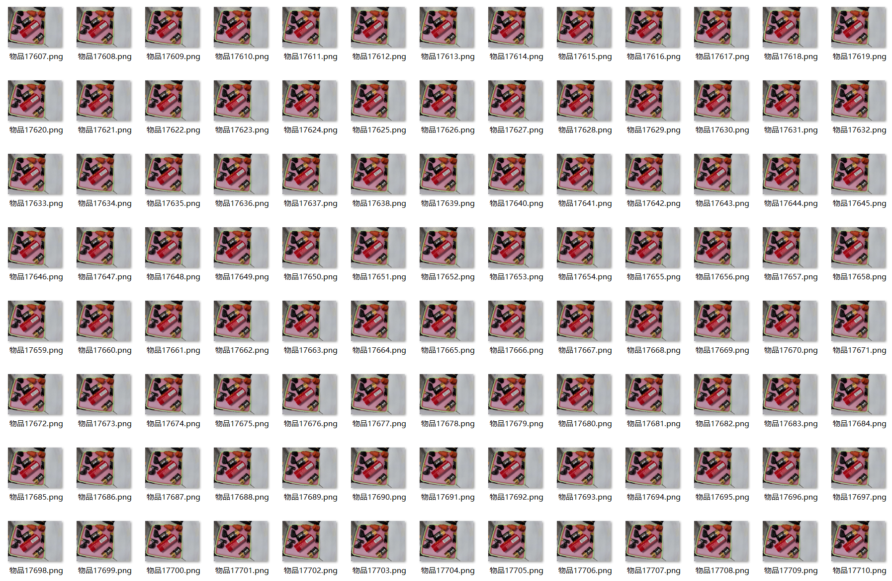

<div align="center">

# 智能分类垃圾桶系统

**基于 STM32F407 + YOLOv5 视觉识别的自动垃圾分类装置**


</div>

---

## 整机工作演示

[](图片/视频演示.mp4)

**▶ [点击播放：整机工作演示](图片/视频演示.mp4)** ｜ [结构爆炸动画](建模/相关资料/爆炸.mp4)

> GitHub 的 Markdown 会过滤 `<video>` 标签，且较大的 `.mp4` 在文件页不提供在线预览，因此这里采用"**封面图 + 跳转链接**"。打开页面后点 `Download` 即可播放；完整图文见 [十、效果展示](#十效果展示)。

---

## 目录

- [一、项目简介](#一项目简介)
- [二、主要功能](#二主要功能)
- [三、系统总体方案](#三系统总体方案)
- [四、硬件系统](#四硬件系统)
- [五、机械结构](#五机械结构)
- [六、软件架构](#六软件架构)
- [七、通信协议](#七通信协议)
- [八、快速开始](#八快速开始)
- [九、参数标定与调试](#九参数标定与调试)
- [十、效果展示](#十效果展示)
- [十一、常见问题](#十一常见问题)
- [十二、后续优化方向](#十二后续优化方向)

---

## 一、项目简介

本项目是一套面向**工程实践与创新能力大赛（工创赛）垃圾分类命题**的完整解决方案，实现"投放 → 识别 → 分拣 → 归仓 → 计数"的全流程自动化。

装置由 **视觉识别模块**、**STM32 主控**、**二维移动平台 + 机械臂**、**四分类仓** 与 **压缩机构** 组成：摄像头采集投入物图像，运行 YOLOv5 目标检测得到**垃圾类别**与**目标中心点坐标**，通过串口下发给 STM32；主控解算后根据场景选择**倾倒式投放**（单个物体）或**机械臂抓取投放**（多个物体），将垃圾投入对应的四分类仓，并实时累计各类垃圾数量。

仓库包含 **嵌入式控制程序、视觉识别程序、三维建模图纸、装配与调试资料**，可支撑从结构设计、加工装配到软件联调的完整复现。

---

## 二、主要功能

| 功能 | 说明 |
| :--- | :--- |
| **视觉自动识别** | 基于 YOLOv5 的目标检测，输出垃圾类别 ID 与目标中心点像素坐标 |
| **四分类自动分拣** | 有害垃圾 / 可回收垃圾 / 厨余垃圾 / 其他垃圾 四类自动归仓 |
| **双投放策略** | 单物体采用**翻板倾倒**，多物体采用**机械臂抓取**，兼顾效率与成功率 |
| **二维精确定位** | 由 2 路闭环步进电机驱动 XY 平台，将图像坐标解算为物理坐标并移动到位 |
| **闭环步进驱动** | 通过 CAN 总线控制 Emm_V5 闭环步进电机，支持双机同步运动 |
| **多自由度机械臂** | PCA9685 输出 16 路 PWM，驱动 9 路舵机完成回转 / 升降 / 夹取 / 翻板动作 |
| **分类计数与状态反馈** | 主控实时累计四类垃圾数量，并通过调试串口输出运行状态 |
| **压缩机构（预留）** | TIM4 双路 PWM + 方向 IO + 光电限位，用于桶内垃圾压缩与到位检测 |
| **一键启动** | 独立按键触发投放流程，便于现场演示与调试 |

---

## 三、系统总体方案

### 3.1 系统架构

```
┌──────────────┐   USART3(9600)    ┌──────────────────┐
│              │  类别/坐标/数量    │                  │
│  MaixCam     │ ────────────────► │   STM32F407ZGT6  │
│  视觉模块     │ ◄────────────────  │     主控          │
│ (YOLOv5)     │   请求指令 "FS"    │                  │
└──────────────┘                   └────────┬─────────┘
                                            │
             ┌──────────────────────────────┼──────────────────────────┐
             │                              │                          │
      CAN1(500kbps)                  软件 I2C(PC7/PC8)          TIM4 PWM + GPIO
             │                              │                          │
    ┌────────▼────────┐          ┌──────────▼─────────┐      ┌─────────▼────────┐
    │ Emm_V5 闭环步进  │          │     PCA9685        │      │  压缩机构 / 限位   │
    │  #1  #2 (X/Y)   │          │  16 路 PWM 舵机板   │      │  光电开关 ×3      │
    └────────┬────────┘          └──────────┬─────────┘      └──────────────────┘
             │                              │
      XY 二维移动平台              机械臂(升降/回转/夹爪) + 分类翻板 + 仓盖
```

### 3.2 工作时序

```
上电
 │
 ├─ 外设初始化：GPIO / DMA / USART1 / USART3 / TIM4 / CAN1
 ├─ 步进电机初始化、PCA9685 初始化(50Hz)
 ├─ 开启 USART3 空闲中断 + DMA 接收
 ├─ 舵机复位（合盖、平台归位）
 ▼
┌──────────── 主循环 ────────────┐
│  1. 发送 "FS" 请求视觉识别       │
│  2. 等待视觉返回 type / x / y / n │
│  3. 判断数量 n                   │
│     ├─ n = 1 → 翻板倾倒投放      │
│     └─ n ≥ 2 → 机械臂抓取投放    │
│  4. 类别计数 n_0 ~ n_3 自增      │
│  5. 机构复位，返回步骤 1          │
└────────────────────────────────┘
```

---

## 四、硬件系统

### 4.1 主控与外设资源分配

主控：**STM32F407ZGT6**（LQFP144，168 MHz，HSE 8 MHz → PLL 168 MHz；APB1 42 MHz / APB2 84 MHz）

| 外设 | 引脚 | 参数 | 用途 |
| :--- | :--- | :--- | :--- |
| **USART1** | PA9 / PA10 | 9600-8-N-1，DMA2_Stream2 | 调试串口（`printf` 已重定向），运行日志输出 |
| **USART3** | PC10 / PC11 | 9600-8-N-1，DMA1_Stream1 + 空闲中断 | 与视觉模块双向通信 |
| **CAN1** | PB8 / PB9 | 500 kbps（42 MHz ÷14 ÷6 TQ） | Emm_V5 闭环步进电机指令 |
| **TIM4 CH1** | PB6 | PWM 1 kHz（PSC 83 / ARR 1000） | 压缩机构驱动 |
| **TIM4 CH2** | PB7 | PWM 1 kHz | 辅助执行机构调速 |
| **软件 I2C** | PC7(SDA) / PC8(SCL) | 推挽 + 上拉 | PCA9685 舵机控制板 |
| **GPIO 输出** | PC4 / PC5 / PC9 / PA8 | 推挽输出 | 电机方向 / 使能控制 |
| **GPIO 输入** | PG3 / PG5 / PG7 | 上拉输入（`GD3` / `GD2` / `GD1`） | 光电开关，用于到位检测与限位 |
| **GPIO 输入** | PB3（`key_s1`） | 上拉输入 | 启动 / 触发按键 |

### 4.2 舵机通道分配（PCA9685，50 Hz）

| 通道 | 代码变量 | 参考值 | 机械含义（以实际装配为准） |
| :---: | :--- | :---: | :--- |
| 0 | `angle_0` | 130 | 分类翻板 A（外摆 `+45`） |
| 1 | `angle_1` | 130 | 分类翻板 B（配合通道 0 组合出四种倾倒方向） |
| 2 | `angle_2` | 120 | 机械臂夹爪（夹紧 `+50`） |
| 3 | `angle_3` | 152 | 机械臂升降（下压 `-90`） |
| 4 | `angle_4` | 250 | 机械臂回转（转位 `-90`） |
| 5 | `angle_5` | 140 | 辅助执行机构（仓盖 / 挡板联动） |
| 6 | `angle_6` | 125 | 辅助执行机构 |
| 7 | `angle_7` | 170 | 辅助执行机构 |
| 8 | `angle_8` | 70 | 辅助执行机构 |

> 四路倾倒姿态由通道 0/1 的 `±45°` 组合而成，对应四个分类仓；所有角度均为 **270° 舵机映射值**（`setAngle270`），装机后需逐路标定。

### 4.3 视觉模块

| 项目 | 规格 |
| :--- | :--- |
| 主控 | **MaixCam**（MaixPy 运行环境） |
| 算法 | **YOLOv5**（MaixHub 训练，产出 `.mud` 模型） |
| 接口 | `/dev/ttyS0`，9600-8-N-1 |
| 输出 | 类别 ID、目标中心点像素坐标 `(x, y)`、目标数量 `n` |

> 视觉方案共迭代两版：**MaixCam 版** 与 **树莓派版**，二者原理一致（YOLO 检测 → 下发类别与坐标 → STM32 解算执行）。出于部署便利性考虑，**本仓库开源 MaixCam 版本**。

### 4.4 主要器件清单

| 类别 | 器件 |
| :--- | :--- |
| 主控 | STM32F407ZGT6 最小系统板 |
| 视觉 | MaixCam（含摄像头与显示屏） |
| 舵机驱动 | PCA9685 16 路 PWM 舵机控制板 |
| 舵机 | 270° 舵机 ×9（含 MG995 等） |
| 步进 | Emm_V5 闭环步进电机 ×2（CAN 接口，地址 1 / 2） |
| 传动 | 2020 铝型材、GT2 同步带与皮带轮、MGN9 线轨与滑块、6 mm / 8 mm 光轴、直线轴承 |
| 传感 | 光电开关 ×3 |
| 结构 | 3D 打印件（滑块、轴座、支架）+ 铝型材框架 + 亚克力 / 钣金挡板 |

---

## 五、机械结构

整机采用 **铝型材框架 + 3D 打印连接件** 的方案，自下而上分为四层：

1. **框架层**：2020 铝型材搭建主体框架，脚码连接，配侧板、护板与外层挡板。
2. **移动平台层**：X / Y 双轴由闭环步进电机经 GT2 同步带驱动，光轴 + 直线轴承 / MGN9 线轨导向，构成二维定位平台。
3. **执行层**：平台下方悬挂机械臂（回转 + 升降 + 夹爪），配合四组分类翻板完成投放。
4. **存储层**：四个独立分类仓，底部布置压缩机构（挡板 + 推杆），配合光电开关实现到位检测。

| 图纸 | 文件 |
| :--- | :--- |
| 总装配体 | `建模/第五版.SLDASM`、`建模/装配体2.SLDASM` |
| 零件 | `建模/*.SLDPRT`（铝型材、光轴、滑块、支架、挡板、仓体等 65 个零件） |
| 工程图 | `建模/相关资料/工程图2.pdf`、`工程图333.dwg`、`工程图.jpg` |
| 说明文档 | `建模/相关资料/垃圾分类命题文档（改）.doc` |

---

## 六、软件架构

### 6.1 目录结构

```
工创垃圾桶/
├─ README.md                  # 本文件
├─ .gitignore                 # Git 忽略规则
│
├─ stm32控制/                 # 嵌入式控制程序
│  └─ stm32_hal/
│     ├─ gongchuang.ioc       # STM32CubeMX 工程配置（引脚 / 时钟 / 外设）
│     ├─ Core/                # CubeMX 自动生成：时钟、GPIO、DMA、USART、TIM、CAN
│     ├─ Drivers/             # STM32F4 HAL 库 + CMSIS（不入库，见下方说明）
│     ├─ hard_with_sofa/      # ★ 应用层驱动与业务逻辑（本项目核心代码）
│     └─ MDK-ARM/             # Keil uVision 工程（gongchuang.uvprojx）
│
├─ 视觉方案/                   # 视觉识别程序
│  ├─ gongc.py                # MaixCam 端 YOLOv5 检测 + 串口通信
│  └─ readme.txt              # 视觉方案说明
│
├─ 建模/                      # SolidWorks 三维模型
│  ├─ 第五版.SLDASM / 装配体2.SLDASM
│  ├─ *.SLDPRT                # 全部零件
│  └─ 相关资料/                # 工程图(PDF/DWG)、渲染图、命题文档
│     └─ 爆炸.mp4              # 结构爆炸动画
│
└─ 图片/                      # 效果展示与演示资料
   ├─ 整体外观.png / 内部结构图.png
   ├─ 垃圾桶装配.png / 垃圾桶装配图.png
   ├─ 识别.jpg / 数据集采集.png
   └─ 视频演示.mp4
```

### 6.2 应用层模块说明（`hard_with_sofa/`）

| 文件 | 说明 |
| :--- | :--- |
| `sys.h` | 公共头文件汇总；位带操作宏（`PAout/PAin`…）；光电传感器 `GD1/GD2/GD3` 宏定义 |
| `delay.c/.h` | 基于指令循环的软件延时 `for_delay_us()` / `for_delay_ms()`（按 168 MHz 主频标定） |
| `PCA9685.c/.h` | 软件 I2C（PC7/PC8）+ PCA9685 驱动，`PCA9685_Init()`、`PCA9685_setPWM()`、`setAngle90/180/270/360()` |
| `Emm_V5.c/.h` | Emm_V5 闭环步进电机 CAN 指令集：位置控制、速度控制、同步运动、急停、回零、参数读取 |
| `MOTOR.c/.h` | 平台运动封装：`move()` 双轴移动、`compress()` 压缩控制、`GD()` 限位读取 |
| `myusart.c/.h` | 串口 DMA + 空闲中断接收、视觉数据帧解析状态机、`printf` 重定向、`UART3_SendString()` |
| `capture.c/.h` | **核心业务逻辑**：`control()` 机构动作组合、`initial()` 自动分拣主流程 |

### 6.3 开发环境

| 项目 | 版本 / 工具 |
| :--- | :--- |
| 单片机 | STM32F407ZGT6 |
| 固件库 | STM32Cube FW_F4 **V1.28.1** |
| 配置工具 | STM32CubeMX（打开 `gongchuang.ioc`） |
| 编译工具 | **Keil MDK-ARM V5.27+**（ARMCC5） |
| 下载调试 | ST-Link / CMSIS-DAP（SWD） |
| 视觉端 | MaixCam + MaixPy + MaixHub 训练平台 |
| 建模 | SolidWorks（2020 及以上可打开 `.SLDPRT` / `.SLDASM`） |

---

## 七、通信协议

### 7.1 视觉 → 主控（USART3，9600-8-N-1）

采用**定长帧 + 帧头帧尾校验**，共 **11 字节，小端序**（对应 MaixPy 的 `struct.pack("<bbhhhhb", ...)`）：

| 字节偏移 | 0 | 1 | 2 ~ 3 | 4 ~ 5 | 6 ~ 7 | 8 ~ 9 | 10 |
| :---: | :---: | :---: | :---: | :---: | :---: | :---: | :---: |
| **含义** | 帧头 | 帧头 | 类别 `type` | 中心 X `x` | 中心 Y `y` | 数量 `n` | 帧尾 |
| **取值** | `0x2C` | `0x2E` | int16 | int16 | int16 | int16 | `0x5B` |

主控侧由 `process_received_data3()` 以**四状态机**（等帧头 → 校验第二字节 → 收数据 → 校验帧尾）解析，解析成功后置位 `cam_flag` 并更新全局变量 `type / x / y / n`。

### 7.2 主控 → 视觉（USART3）

| 指令（ASCII） | 含义 | 使用场景 |
| :--- | :--- | :--- |
| `FS` | 请求一次识别并回传结果 | 自动分拣主流程中轮询 |
| `FSSJ` | 请求发送识别结果数据 | 抓取流程中逐次请求目标数据 |

视觉端收到任意数据后，将当前帧检测结果回发一帧。

### 7.3 类别映射表

主控侧保留 14 个类别 ID 到四类垃圾的映射（见 `capture.c`，可按自己的模型类别自行修改）：

| 类别 ID | 垃圾类别 | 计数变量 |
| :--- | :--- | :--- |
| 0 / 1 / 11 / 12 | 有害垃圾 | `n_0` |
| 2 / 3 / 9 | 可回收垃圾 | `n_1` |
| 4 / 5 / 6 / 10 / 13 | 厨余垃圾 | `n_2` |
| 7 / 8 | 其他垃圾 | `n_3` |

本仓库附带的 MaixCam 模型为 **4 类**（`电池 / 易拉罐 / 石头 / 胡萝卜`），视觉端按 `class_id + 1` 下发 `type = 1 ~ 4`；若更换或扩充模型，请同步修改 `capture.c` 中的映射关系。

### 7.4 步进电机（CAN1，500 kbps）

| 指令函数 | 功能 |
| :--- | :--- |
| `Emm_V5_Pos_Control(addr, dir, vel, acc, clk, raF, snF)` | 位置模式控制（写入目标脉冲） |
| `Emm_V5_Synchronous_motion(addr)` | 触发多机同步启动 |
| `Emm_V5_Stop_Now(addr, snF)` | 立即停止 |
| `Emm_V5_En_Control` / `Emm_V5_Vel_Control` | 使能 / 速度模式 |
| `Emm_V5_Origin_Trigger_Return` | 触发回零 |

X / Y 双轴分别使用地址 **1** 与 **2**，先分别下发位置指令，再调用同步运动，实现双轴协同。

---

## 八、快速开始

### 8.1 硬件准备与接线

| 模块 | 接线 |
| :--- | :--- |
| 视觉模块 | MaixCam `ttyS0` TX → `PC11(USART3_RX)`；RX → `PC10(USART3_TX)`；**共地** |
| PCA9685 | `SDA → PC7`，`SCL → PC8`，VCC/GND 共地，舵机电源独立供电 |
| 步进电机 | CAN_H / CAN_L → `PB8 / PB9`，总线上加 **120 Ω 终端电阻**，地址设为 1 与 2 |
| 压缩机构 | TIM4 `PB6 / PB7` → 驱动模块 PWM；`PC4 / PC5 / PC9 / PA8` → 方向与使能 |
| 光电开关 | `PG3 / PG5 / PG7`（上拉输入，触发电平按传感器类型确认） |
| 启动按键 | `PB3`（上拉输入，按下接低） |

### 8.2 编译与下载（STM32）

1. 安装 **Keil MDK-ARM V5** 及 STM32F4 器件支持包（DFP）。
2. **（首次克隆必做）** 用 STM32CubeMX 打开 `gongchuang.ioc` → **Generate Code**，补齐未入库的 `Drivers/` 固件库。
3. 打开 `stm32控制/stm32_hal/MDK-ARM/gongchuang.uvprojx`。
4. 确认 `Options for Target → C/C++ → Include Paths` 包含：
   ```
   Core/Inc  Drivers/STM32F4xx_HAL_Driver/Inc  Drivers/CMSIS/Device/ST/STM32F4xx/Include
   Drivers/CMSIS/Include  hard_with_sofa
   ```
5. 点击 **Rebuild** 编译，用 ST-Link / CMSIS-DAP 经 SWD **Download**。
6. 修改引脚或外设参数：用 STM32CubeMX 打开 `gongchuang.ioc` 重新生成代码（用户代码写在 `USER CODE BEGIN/END` 之间，不会被覆盖）。

> 📦 **重要：`Drivers/` 未入库。** 为控制仓库体积，STM32 固件库（HAL + CMSIS，约 20 MB）已由 `.gitignore` 排除，因为它可由 CubeMX **100% 还原**。
>
> **克隆本仓库后的第一步**：用 STM32CubeMX 打开 `stm32控制/stm32_hal/gongchuang.ioc` → 点击 **Generate Code**，生成 `Drivers/` 后再用 Keil 打开工程编译即可。

### 8.3 视觉端部署（MaixCam）

1. 在 [MaixHub](https://maixhub.com) 训练 YOLOv5 模型，或使用自备模型，得到 `.mud` 文件。
2. 将模型上传至 MaixCam，例如 `/root/models/model_167094.mud`。
3. 修改 `视觉方案/gongc.py` 中的模型路径：
   ```python
   detector = nn.YOLOv5(model="/root/models/model_167094.mud", dual_buff=True)
   ```
4. 将 `gongc.py` 导入 MaixCam 并运行，屏幕会实时显示检测框、类别与置信度。
5. 检测阈值可在 `detector.detect(img, conf_th=0.5, iou_th=0.45)` 中调整。

> ⚠️ **模型文件（`.mud`）未包含在仓库中**，需自行训练或自备。采集数据集时建议覆盖实际赛题的全部类别，并保持光照、角度、遮挡的多样性。

### 8.4 运行

1. 先给舵机与步进电机独立供电，再给主控上电（避免上电瞬间舵机抖动）。
2. 上电后机构自动复位：合盖 → 平台归位 → 夹爪张开。
3. 投入垃圾后，主控自动轮询视觉模块，识别完成后执行投放并更新计数。
4. 调试阶段可通过 **USART1（PA9/PA10，9600）** 查看运行日志。

---

## 九、参数标定与调试

首次装机需按实际尺寸标定以下参数（位于 `main.c` 与 `capture.c`）：

| 参数 | 默认值 | 说明 |
| :--- | :--- | :--- |
| `strat_x` / `end_x` | 220 / 480 | 图像 X 方向有效区间（像素） |
| `start_y` / `end_y` | 125 / 390 | 图像 Y 方向有效区间（像素） |
| `err_x` / `err_y` | `4.0/220` / `3.8/265` | 像素坐标 → 物理位移的比例系数 |
| `x_b` / `x_e` | 4.7 / 0.9 | 平台 X 轴起止物理坐标 |
| `y_b` / `y_e` | 0 / -3.5 | 平台 Y 轴起止物理坐标 |
| `x_count` / `y_count` | 4.5 / 4.5 | 平台行程 |
| `3200` | — | 每单位位移对应脉冲数（`Emm_V5_Pos_Control` 的 `clk`） |
| `angle_0 ~ angle_8` | 130/130/120/152/250/140/125/170/70 | 9 路舵机中位角度 |

**标定建议**

- **视觉标定**：在平台行程的四角放置标定物，记录像素坐标与实际位移，反解 `err_x` / `err_y`。
- **舵机标定**：逐路调用 `setAngle270()` 观察机构极限位，避免堵转烧毁；把安全中位写回 `angle_x`。
- **步进标定**：先单轴低速试运行，确认方向（`dir`）与限位（`GD1/GD2`）逻辑正确后再联动。

---

## 十、效果展示

### 10.1 演示视频

> GitHub 的 Markdown **不支持 `<video>` 标签**，且体积较大的 `.mp4` 在文件页无法在线预览，因此这里统一用"**封面图 + 跳转链接**"：点封面进入文件页后，再点 `Download` 播放。

**① 整机工作演示** —— `图片/视频演示.mp4`（4.2 MB）

[](图片/视频演示.mp4)

**② 结构爆炸动画** —— `建模/相关资料/爆炸.mp4`（7.8 MB）

[](建模/相关资料/爆炸.mp4)

> 💡 **需要真正的内联播放器**：在 GitHub 网页端编辑 README 时，把 mp4 **直接拖拽进编辑框**，GitHub 会将其上传到 `user-attachments` CDN 并返回一条 `https://github.com/user-attachments/assets/...` 链接，用它替换上面的相对路径即可——这是 GitHub 官方支持的内联视频方式（相对路径的 `<video>` 一定会被过滤）。

### 10.2 图片

| 内容 | 文件 |
| :--- | :--- |
| 整体外观 | `图片/整体外观.png` |
| 内部结构 | `图片/内部结构图.png` |
| 装配图 | `图片/垃圾桶装配.png`、`图片/垃圾桶装配图.png` |
| 识别效果 | `图片/识别.jpg` |
| 数据集采集 | `图片/数据集采集.png` |
| 渲染图 / 工程图 | `建模/相关资料/` |








---

## 十一、常见问题

<details>
<summary><b>Q1：Keil 编译报 "No such file or directory"</b></summary>

检查 `Options for Target → C/C++ → Include Paths` 是否包含 `hard_with_sofa`、`Core/Inc` 及 `Drivers` 下相关目录（见 8.2）。
</details>

<details>
<summary><b>Q2：视觉模块无数据返回</b></summary>

1. 确认波特率一致（双方均 9600-8-N-1）；
2. 确认 TX / RX 交叉连接且**共地**；
3. 用调试串口打印 `type / x / y / n`，确认帧头 `0x2C 0x2E` 与帧尾 `0x5B` 是否解析成功；
4. 确认 MaixCam 端已正确加载模型路径。
</details>

<details>
<summary><b>Q3：步进电机不动作或方向相反</b></summary>

1. 确认 CAN 波特率 500 kbps，总线两端接 120 Ω 终端电阻；
2. 确认两台电机地址分别为 1 与 2，且未冲突；
3. 方向相反时修改 `move()` 中的 `direr` 逻辑或调换电机相序；
4. 确认 `Emm_V5_Pos_Control` 后调用了 `Emm_V5_Synchronous_motion(0)` 触发同步。
</details>

<details>
<summary><b>Q4：舵机角度不对或抖动</b></summary>

1. 确认 PCA9685 频率为 50 Hz（`PCA9685_Init(50, 0)`）；
2. 舵机电源需独立供电且与控制板共地；
3. 用 `setAngle270()` 重新标定 `angle_0 ~ angle_8`；
4. 抖动多由供电不足或机械卡滞引起，检查机构配合间隙。
</details>

<details>
<summary><b>Q5：识别准确率不足</b></summary>

1. 扩充数据集（各类别不少于数百张，覆盖不同光照 / 角度 / 遮挡）；
2. 调整 `conf_th` / `iou_th`；
3. 确认摄像头焦距与安装角度，使检测区域完整覆盖投放区。
</details>


---

## 十二、后续优化方向

- [ ] 扩充垃圾类别数量，提升小目标与遮挡场景下的识别精度
- [ ] 将阻塞式延时改为**状态机 + 定时器调度**，提升系统实时性与响应性
- [ ] 增加**满桶检测**与**自动压缩**的完整联动逻辑
- [ ] 增加投放成功率自检与异常处理（卡料、夹取失败重试）
- [ ] 上位机 / 移动端数据可视化，统计分类趋势
- [ ] 结构轻量化与模块化，缩短装配与维护时间
- [ ] 引入 ROS / 树莓派方案，实现更丰富的场景扩展
